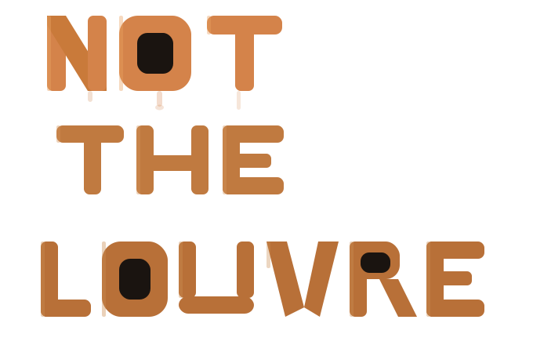

<p align="center">
  
</p>


*[Leer en Español 🇪🇸](./README.es.md)*

> "A very expensive frame for a very questionable drawing."

Welcome to the classiest art institution on the internet, where the presentation says "national treasure" and the actual piece says "cat drawn in 40 seconds with a trackpad."

**Not The Louvre** is a community art party game built for the [Midudev Cubepath 2026 Hackathon](https://github.com/midudev/hackaton-cubepath-2026). You draw something, publish it, fork other people's work, and let the crowd decide whether you've made a masterpiece or a public embarrassment.

---

## 🧐 So what is it, really?

It's a museum sim for people whose artistic peak was doodling in MS Paint.

You open the app, sketch something mildly unhinged, hit publish, and wait for the public to either crown you the next genius or pelt your work with a perfectly justified tomato.

### ✨ Features, allegedly

- 🖌️ **A deeply serious drawing tool**: You get a brush, an eraser, and a few colors. That's it. No layers, no shapes, no bucket fill. If your vision depends on advanced tooling, perhaps your vision was weak.
- 🍴 **Forking, or tasteful art vandalism**: See something beautiful? Fork it, keep the original as a locked background, and add the moustache it was clearly missing. The full ancestry stays visible, so credit and blame are both preserved.
- 🎩 **Needlessly elegant 2.5D presentation**: Built with **Threlte**. The gallery glows, moves, and shows off like a millionaire's foyer. The artwork is still a flat little PNG. That mismatch is the whole point.
- 🍅 **Public curation with produce**: Upvote what deserves applause, downvote what deserves a tomato. Yes, the tomato actually drops on screen. We believe in responsive feedback.
- 🛡️ **A small AI doorman**: Client-side NSFWJS checks whether you're trying to upload something that would get the museum shut down by lunchtime. Go on, try it. It still won't let you publish.

## 🛠️ The stack behind the nonsense

Because even a joke needs plumbing:
- **Frontend:** SvelteKit.
- **3D / Graphics:** Threlte + HTML5 Canvas 2D API.
- **Backend / Database:** Supabase.
- **Realtime:** Supabase Realtime.
- **Moderation:** NSFWJS in the browser.

## 📦 Repository layout

The repository now uses a small Bun workspace so the root stays focused on shared docs and infra.

```text
.
├── apps/
│   └── web/        # SvelteKit app
├── docs/           # Product and project docs
├── compose.yaml    # Local Postgres
└── package.json    # Workspace scripts
```

- Run the app from the repository root with `bun run dev`, `bun run check`, `bun run build`, etc.
- App-specific configuration now lives in `apps/web`.
- Environment files for the app now live in `apps/web/.env` and `apps/web/.env.example`.

## 📜 The philosophy

The whole idea is to get people from "I opened the browser" to "I published a ridiculous drawing" in under two minutes. No long onboarding, no solemn creative process, no paywall pretending to be a feature. Just draw, laugh, judge, repeat.

---
*Built with ❤️ and a medically unnecessary amount of caffeine for Cubepath 2026.*
